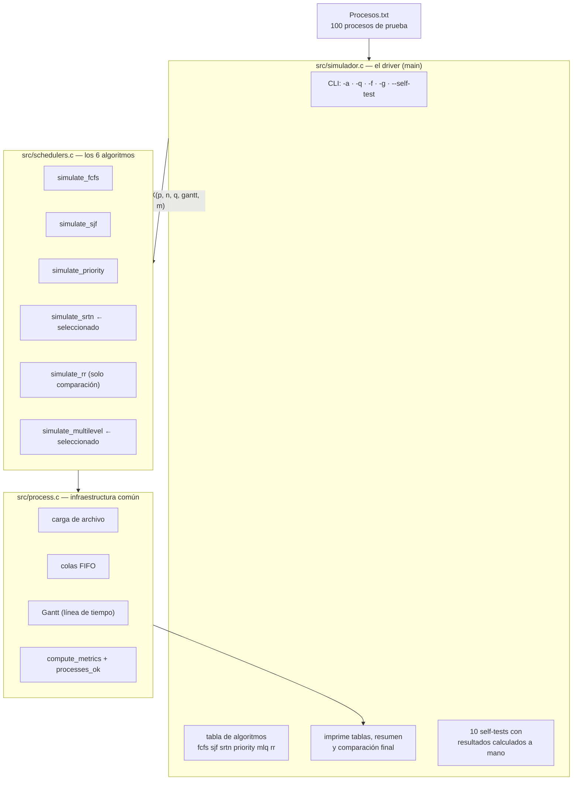
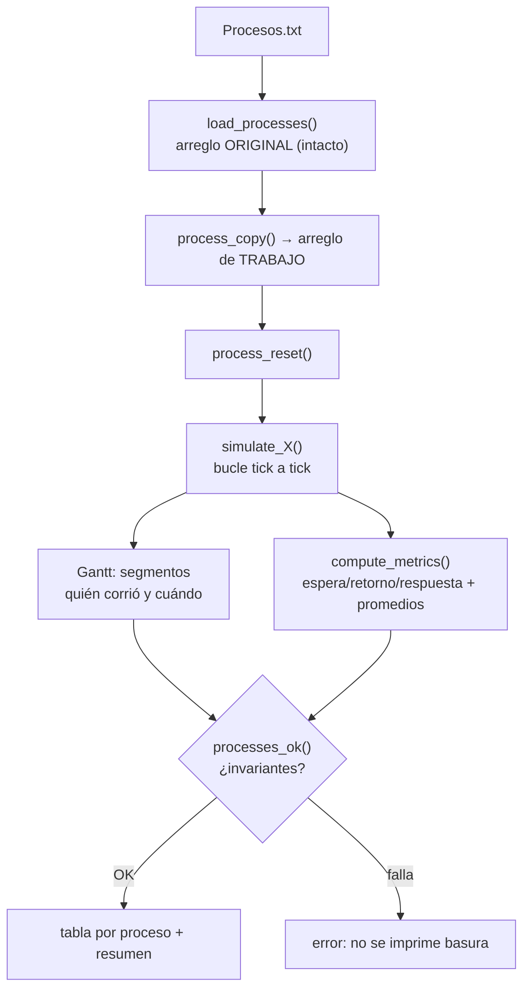
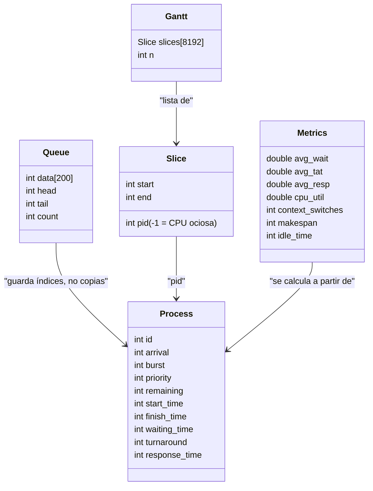
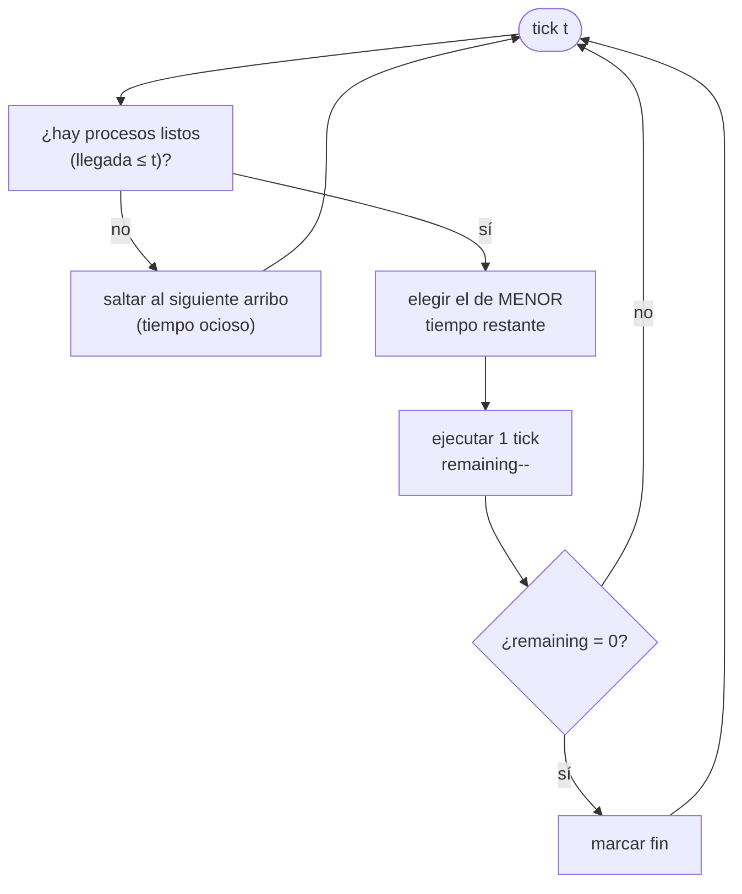
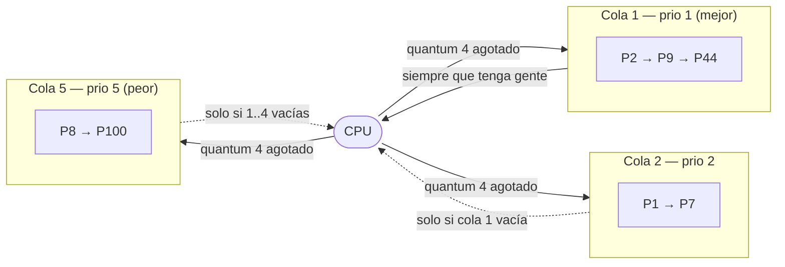
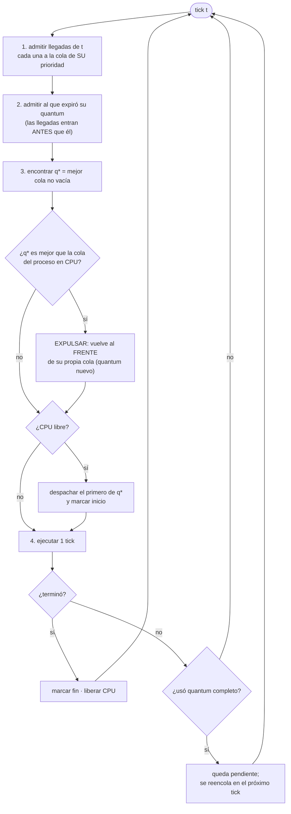

# Diagramas para entender el simulador

Material de estudio para la exposición. Los diagramas de bloques están en
Mermaid (se ven renderizados en GitHub o en VS Code con la extensión
*Markdown Preview Mermaid Support*); cada uno tiene su versión ASCII al lado
para leerlos en terminal. Todos los Gantt que aparecen aquí son salida real
del programa.

---

## 1. Mapa del proyecto: quién llama a quién



Versión ASCII:

```
Procesos.txt
     │  load_processes()
     ▼
┌─────────────────────────────────────────────┐
│ simulador.c   (main, CLI, self-tests)       │
│   -a elige algoritmo · -q quantum · -f arch │
└──────────────┬──────────────────────────────┘
               │  simulate_X(p, n, q, &gantt, &m)
               ▼
┌─────────────────────────────────────────────┐
│ schedulers.c  fcfs · sjf · priority         │
│               srtn* · rr · multilevel*      │   * = nuestros algoritmos
└──────────────┬──────────────────────────────┘
               │  usan colas, marcan Gantt, piden métricas
               ▼
┌─────────────────────────────────────────────┐
│ process.c   colas FIFO · Gantt · métricas   │
│             invariantes (processes_ok)      │
└─────────────────────────────────────────────┘
```

La clave del diseño: **cada algoritmo tiene la misma firma**
(`simulate_X(Process *p, int n, [quantum,] Gantt *g, Metrics *m)`) y solo se
comunica con el resto a través del Gantt y de `Metrics`. Por eso son
intercambiables y comparables.

---

## 2. Flujo de una corrida completa



Por qué se copia el arreglo: la simulación **modifica** los procesos
(`remaining`, `finish_time`, …). Copiar garantiza que los 6 algoritmos
arranquen exactamente de los mismos datos → comparación justa.

---

## 3. Estructuras de datos



Puntos finos que pueden preguntar:

- La **`Queue` guarda índices** (`int data[]`), no `Process` completos →
  las colas nunca duplican estado; el proceso "real" vive en un solo lugar.
- `Slice.pid == -1` significa **CPU ociosa** (hueco sin procesos listos).
- `gantt_add` **fusiona** segmentos consecutivos del mismo pid (si P1 corre
  0-4 y 4-8 sin interrupción, es un solo segmento 0-8).

---

## 4. Cómo se calculan las métricas

Ejemplo: proceso que llega en t=0, ráfaga 10, empieza en t=4 y termina en t=14.

```
t=0            t=4                      t=14
 │──────────────│─────────────────────────│
 │   espera=4   │      ejecución=10       │
 │<──────────────── retorno = 14 ─────────────────>│
 │<─ respuesta=4 ─>│
llegada      primer inicio              fin
```

| Métrica | Fórmula | En el ejemplo |
|---|---|---|
| Espera (waiting) | fin − llegada − ráfaga | 14 − 0 − 10 = 4 |
| Retorno (turnaround) | fin − llegada | 14 − 0 = 14 |
| Respuesta (response) | primer inicio − llegada | 4 − 0 = 4 |

Ojo con la diferencia **retorno vs respuesta**: respuesta solo mide hasta el
*primer* tick de CPU; retorno mide hasta que el proceso **termina del todo**.
Un proceso puede tener respuesta 0 y espera grande (arrancó al instante, pero
lo expulsaron mil veces). Eso es exactamente lo que pasa con MLQ en el
dataset oficial: las colas 1-2 tienen respuesta 0 pero espera alta.

---

## 5. SRTN: el bucle



Regla única: en **cada tick** se reevalúa y gana el de menor `remaining`.
Es apropiativo *por definición*: si llega alguien con menos trabajo, expulsa
al que está corriendo (desempate: llegada, luego id).

---

## 6. MLQ: estructura de colas

```
        Cola 1 (prio 1)   [P2]→[P9]→[P44]     ← se atiende SIEMPRE primero
        Cola 2 (prio 2)   [P1]→[P7]
        Cola 3 (prio 3)   [P3]
        Cola 4 (prio 4)   [P5]
        Cola 5 (prio 5)   [P8]→[P100]         ← puede esperar muchísimo
        ─────────────────────────────────────
        · RR con quantum 4 DENTRO de cada cola
        · Prioridad ABSOLUTA entre colas
        · Un proceso NUNCA cambia de cola (si cambiara, sería MLFQ)
```



La diferencia con MLFQ (E09), en una frase: en MLQ la prioridad es **fija**
(el proceso nace en una cola y muere en ella); en MLFQ el proceso **baja de
cola** cuando consume todo su quantum. Nuestro código no mueve procesos entre
colas nunca.

---

## 7. MLQ: el bucle de un tick (esto es lo que hay que saber explicar)



Tres decisiones de diseño que hay que saber defender:

1. **El expulsado vuelve al FRENTE de su cola** (no al final): no consumió su
   quantum, así que conserva su turno. Para eso existe `queue_push_front`.
2. **Al reanudar recibe quantum nuevo**: el quantum mide *servicio continuo*.
3. **Las llegadas de t se admiten antes de reencolar al expirado**: así MLQ
   coincide con RR cuando todos los procesos caen en la misma cola (es la
   convención documentada en README; hubo un bug aquí y ahora hay un
   self-test que lo cubre).

---

## 8. SRTN vs MLQ: dos casos lado a lado (salida real)

### Caso A — misma prioridad, uno más corto

`P1: llega 0, ráfaga 10, prio 2` · `P2: llega 2, ráfaga 2, prio 2` · q=4

```
SRTN   | P1   0-2 | P2   2-4 | P1   4-12 |    espera 1.0  respuesta 0.0
MLQ    | P1   0-4 | P2   4-6 | P1   6-12 |    espera 2.0  respuesta 1.0
```

- SRTN expulsa a P1 en t=2 (P2 tiene menos restante: 2 < 8).
- MLQ **no** expulsa entre procesos de la *misma* cola: P1 termina su quantum
  (0-4), y P2 pasa (4-6). Dentro de una cola es puro RR.

### Caso B — prioridad alta larga vs prioridad baja corta

`P1: llega 0, ráfaga 10, prio 1` · `P2: llega 2, ráfaga 2, prio 3` · q=4

```
SRTN   | P1   0-2 | P2   2-4 | P1   4-12 |    P2 respuesta 0
MLQ    | P1   0-10        | P2  10-12 |       P2 respuesta 8  ← inanición
```

- SRTN ignora la prioridad: ve 2 < 8 y deja pasar a P2.
- MLQ aplica **prioridad absoluta**: la cola 1 nunca se vacía, así que P2
  (cola 3) no toca la CPU hasta que P1 termina. Ese es el precio de la
  prioridad estricta — y es la misma historia que cuenta el reporte con el
  dataset oficial (cola 5 arranca en t≈400).

Estos dos casos son el "elevator pitch" de por qué los dos algoritmos son
diferentes aunque ambos sean apropiativos.

---

## 9. Los 6 algoritmos y su papel

| Función | ¿Apropiativo? | Regla de selección | Papel |
|---|---|---|---|
| `simulate_fcfs` | No | orden de llegada | comparación (FCFS es individual, E05) |
| `simulate_sjf` | No | menor ráfaga total | comparación |
| `simulate_priority` | No | menor número = mejor | comparación (E05) |
| `simulate_srtn` | **Sí** | menor tiempo restante | **SELECCIONADO (3 pts)** |
| `simulate_rr` | Sí | turnos por quantum | comparación (RR es de E01) |
| `simulate_multilevel` | **Sí** | mejor cola + RR dentro | **SELECCIONADO (3 pts)** |

---

## 10. Qué mirar en el dataset oficial (Procesos.txt)

100 procesos, llegadas cada 2 u.t., ráfagas 2-10, prioridades 1-5.

- Colas 1-2 (40 procesos): **respuesta 0** — arrancan al instante.
- Cola 4: primer arranque en t=240. Cola 5: primer arranque en t=400.
- Resultado MLQ q=4: espera media **154.84**, respuesta **108.90**, 179
  cambios de contexto, CPU 100 %.
- Comparación: MLQ gana a RR q=4 en espera y respuesta con los MISMOS 179
  cambios; pierde contra SRTN en espera (SRTN no respeta prioridades) pero
  es más justo por clases.

Comando para reproducir todo en clase:

```bash
make && ./simulador -a mlq -q 4 -g -f Procesos.txt | head -40
make test          # 10/10 self-tests + resultados en results/
```
